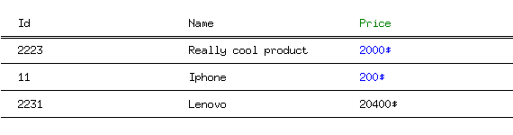

# This is for from https://github.com/Techbinator/go-table-image

# go lang table image

Generates a table inside of a image (png or jpg format) based on the provided data

[](https://godoc.org/github.com/techbinator/go-table-image)

### Goals

- Provide a simple interface in order to generate tables as image programatically
- Save as png or jpg
- Ability to modify colors, multi line columns, image size optimisation
- Do not use any other 3rd party libraries, in order to provide a small bundle size

### Usage examples

- Send slack notification for bigger reports that the Slack api will send as a huge attachment
- Use in combination with a package like https://github.com/rivo/tview in order to create tables from terminal
- Add implementation that would fetch data for example from a json file and generate the image from that

### Usage

```go
package main

import (
	"image/color"

	"tableimage"
)

func main() {
	dimBlack, err := tableimage.GetColorByHex("#171717")
	red, err := tableimage.GetColorByHex("#d03136")
	blue, err := tableimage.GetColorByHex("#0075e2")
	green, err := tableimage.GetColorByHex("#00d841")
	if err != nil {
		panic(err)
	}
	
	ti, err := tableimage.Init(dimBlack, "MicrosoftYahei.ttf")
	if err != nil {
		panic(err)
	}

	ti.AddTH(
		tableimage.TR{
			Tds: []tableimage.TD{
				{
					Text: tableimage.Text{"That", color.White},
				},
				{
					Text: tableimage.Text{"Hello", red},
					// BackgroundColor: purple,
				},
				{
					Text: tableimage.Text{"Beach", blue},
				},
				{
					Text: tableimage.Text{"Peach", green},
				},
				{
					Text: tableimage.Text{"hello", red},
				},
				{
					Text: tableimage.Text{"leisure", blue},
				},
			},
		},
	)

	ti.AddTRs(
		[]tableimage.TR{
			{
				BackgroundColor: color.White,
				Tds: []tableimage.TD{
					{
						Text: tableimage.Text{S: "2223"},
					},
					{
						Text: tableimage.Text{S: "Really cool product on two lines"},
					},
					{},
					{
						Text: tableimage.Text{S: "2000$"},
					},
				},
			},
			{
				// BackgroundColor: purple,
				Tds: []tableimage.TD{
					{},
					{
						Text: tableimage.Text{S: "11"},
					},
					{
						Text: tableimage.Text{S: "A more cooler product this time on 3 lines"},
					},
					{
						Text: tableimage.Text{S: "200$"},
					},
				},
			},
			{
				BackgroundColor: color.White,
				Tds: []tableimage.TD{
					{
						Text: tableimage.Text{S: "2231"},
					},
					{
						Text: tableimage.Text{S: "Lenovo"},
					},
					{
						Text: tableimage.Text{S: "20400$"},
					},
				},
			},
		},
	)

	err = ti.Save(tableimage.PNG, "./test.png")
	if err != nil {
		panic(err)
	}
}
```

Outputs:


